<a id="readme-top"></a>

<br />
<div align="center">
  <h1 align="center">API de Gestión de Gimnasio (Microservicios)</h1>

  <p align="center">
    API REST desarrollada en .NET 10 para la gestión integral de un gimnasio. Implementa una arquitectura de microservicios conectada a través de un API Gateway (YARP), con autenticación JWT y documentación interactiva.
    <br />
  </p>
</div>

---

<details>
  <summary>Tabla de Contenidos</summary>
  <ol>
    <li><a href="#sobre-el-proyecto">Sobre el Proyecto</a></li>
    <li><a href="#construido-con">Construido Con</a></li>
    <li>
      <a href="#primeros-pasos">Primeros Pasos</a>
      <ul>
        <li><a href="#requisitos-previos">Requisitos Previos</a></li>
        <li><a href="#instalación">Instalación</a></li>
      </ul>
    </li>
    <li><a href="#arquitectura-y-endpoints">Arquitectura y Endpoints</a></li>
    <li><a href="#modelo-de-datos">Modelo de Datos</a></li>
    <li><a href="#contacto">Contacto</a></li>
  </ol>
</details>

---

## Sobre el Proyecto


Sistema distribuido para la administración de un gimnasio. Permite gestionar de manera escalable e independiente el acceso de usuarios, la información de socios y entrenadores, las membresías, y la asignación de rutinas de ejercicio. Todo el tráfico se centraliza a través de un Gateway que enruta las peticiones a los microservicios correspondientes.

**Características principales:**
- **Arquitectura basada en Microservicios:** Servicios independientes para Autenticación, Gestión de Clientes y Entrenamiento.
- **API Gateway:** Uso de YARP (Yet Another Reverse Proxy) para el enrutamiento y unificación de dominios.
- **Seguridad JWT:** Generación y validación de tokens JWT con claims de roles (Admin, Socio, Entrenador).
- **Comunicación Síncrona:** Interacción entre microservicios (Ej: Autenticación comunicándose con Gestión de Clientes) mediante `HttpClient`.
- **Documentación Centralizada:** Scalar UI unificada en el Gateway para explorar todos los microservicios desde un solo lugar.

<p align="right">(<a href="#readme-top">volver arriba</a>)</p>

---

## Construido Con

* 
* 
* 
* 

<p align="right">(<a href="#readme-top">volver arriba</a>)</p>

---

## Primeros Pasos

### Requisitos Previos

* [.NET 10 SDK](https://dotnet.microsoft.com/download/dotnet/10.0)
* SQL Server (LocalDB o instancia en servidor)

### Instalación

1. Clonar el repositorio
   ```sh
   git clone [https://github.com/redox11223/gestiongym.git](https://github.com/redox11223/gestiongym.git)


2. Restaurar dependencias en la solución

```sh
dotnet restore GymMicroservicios.slnx
```

3. Aplicar las migraciones

Asegúrate de tener la cadena de conexión configurada en los `appsettings.json` de cada API:

```bash
dotnet ef database update --project src/Autenticacion.API
dotnet ef database update --project src/GestionClientes.API
dotnet ef database update --project src/Entrenamiento.API
```

4. Iniciar los proyectos

Iniciar los proyectos simultáneamente (o ejecutar el Gateway y los servicios dependientes).

5. Documentación interactiva

Abrir la documentación interactiva (Scalar) a través del Gateway:

```
http://localhost:5225/scalar
```

---

## Arquitectura y Endpoints

El proyecto está dividido en tres microservicios principales. Todas las peticiones deben realizarse a través del **Gateway** (por defecto en `http://localhost:5225`), el cual redirige mediante prefijos (`/auth`, `/gestion`, `/entrenamiento`).

---

### 1. Microservicio de Autenticación (`/auth`)

Encargado de la seguridad, gestión de usuarios, roles y emisión de tokens JWT.

| Método | Ruta a través del Gateway | Descripción |
|--------|---------------------------|-------------|
| POST | `/auth/api/auth/login` | Autentica a un usuario y devuelve el token JWT. |
| POST | `/auth/api/auth/register` | Crea un usuario nuevo (Requiere rol Admin). |
| GET | `/auth/api/usuario` | Lista todos los usuarios del sistema. |
| GET | `/auth/api/rol` | Lista los roles disponibles (Admin, Socio, Entrenador). |

---

### 2. Microservicio de Gestión de Clientes (`/gestion`)

Administra el perfil de los socios, entrenadores, membresías y asistencias. Se vincula externamente con los IDs de usuario del servicio de Autenticación.

| Método | Ruta a través del Gateway | Descripción |
|--------|---------------------------|-------------|
| POST | `/gestion/api/socio` | Registra los datos personales y físicos de un socio. |
| GET | `/gestion/api/socio/{id}` | Obtiene los detalles de un socio específico. |
| POST | `/gestion/api/entrenador` | Registra la especialidad y certificaciones de un entrenador. |
| POST | `/gestion/api/membresias` | Crea un nuevo plan de membresía (duración, precio). |
| PUT | `/gestion/api/entrenador/upsert/{id}` | Actualiza o inserta datos de un entrenador (usado internamente). |

---

### 3. Microservicio de Entrenamiento (`/entrenamiento`)

Gestiona el catálogo de ejercicios y las rutinas personalizadas asignadas por los entrenadores a los socios.

| Método | Ruta a través del Gateway | Descripción |
|--------|---------------------------|-------------|
| POST | `/entrenamiento/api/ejercicios` | Agrega un nuevo ejercicio al catálogo. |
| GET | `/entrenamiento/api/ejercicios` | Obtiene el catálogo completo de ejercicios. |
| POST | `/entrenamiento/api/rutinas` | Crea una rutina asignada a un socio por un entrenador, incluyendo sus ejercicios. |
| GET | `/entrenamiento/api/rutinas/{id}` | Consulta una rutina y los ejercicios que la componen. |

---

## Modelo de Datos

A continuación se muestra el esquema Entidad-Relación de las bases de datos de los 3 microservicios.

```mermaid
erDiagram
    %% ================= MICROSERVICIO AUTENTICACIÓN =================
    USUARIOS {
        Guid Id PK
        string Nombre
        string Correo
        string ContrasenaHash
        string Telefono
        bool EsActivo
    }
    ROLES {
        Guid Id PK
        string Nombre
        string NombreNormalizado
    }
    USUARIO_ROLES {
        Guid UsuarioId PK,FK
        Guid RolId PK,FK
        DateTime FechaAsignacion
    }
    USUARIOS ||--o{ USUARIO_ROLES : tiene
    ROLES ||--o{ USUARIO_ROLES : asigna

    %% ================= MICROSERVICIO GESTIÓN CLIENTES =================
    SOCIOS {
        Guid Id PK
        Guid UsuarioId FK "Referencia externa a USUARIOS"
        DateOnly FechaNacimiento
        string Genero
        decimal AlturaCm
        decimal PesoKg
    }
    ENTRENADORES {
        Guid Id PK
        Guid UsuarioId FK "Referencia externa a USUARIOS"
        string Especialidad
        string Certificaciones
        bool EstaActivo
    }
    SOCIO_ENTRENADOR {
        Guid SocioId PK,FK
        Guid EntrenadorId PK,FK
        DateOnly FechaAsignacion
    }
    MEMBRESIAS {
        Guid Id PK
        string Nombre
        string Descripcion
        int DuracionDias
        decimal Precio
    }
    SOCIO_MEMBRESIA {
        Guid Id PK
        Guid SocioId FK
        Guid MembresiaId FK
        DateOnly FechaInicio
        DateOnly FechaFin
    }
    ASISTENCIAS {
        Guid Id PK
        Guid SocioId FK
        DateTime FechaHoraEntrada
        DateTime FechaHoraSalida
    }
    SOCIOS ||--o{ SOCIO_ENTRENADOR : tiene
    ENTRENADORES ||--o{ SOCIO_ENTRENADOR : asignado
    SOCIOS ||--o{ SOCIO_MEMBRESIA : posee
    MEMBRESIAS ||--o{ SOCIO_MEMBRESIA : define
    SOCIOS ||--o{ ASISTENCIAS : registra

    %% ================= MICROSERVICIO ENTRENAMIENTO =================
    RUTINAS {
        Guid Id PK
        Guid SocioId FK "Ref. a SOCIOS"
        Guid EntrenadorId FK "Ref. a ENTRENADORES"
        string Nombre
        string Objetivo
        DateTime FechaInicio
        DateTime FechaFin
    }
    EJERCICIOS {
        Guid Id PK
        string Nombre
        string Descripcion
        string GrupoMuscular
    }
    RUTINA_EJERCICIOS {
        Guid RutinaId PK,FK
        Guid EjercicioId FK
        int Orden PK
    }
    RUTINAS ||--o{ RUTINA_EJERCICIOS : contiene
    EJERCICIOS ||--o{ RUTINA_EJERCICIOS : usa
```



---

## Contacto

- **Repositorio:** [https://github.com/redox11223/gestiongym](https://github.com/redox11223/gestiongym)
